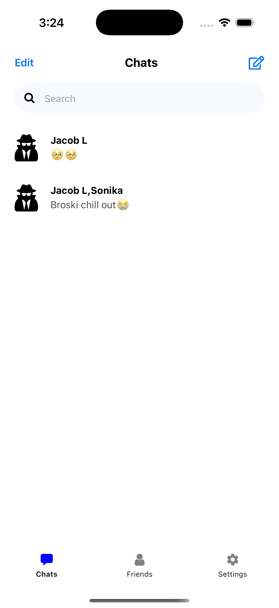

# 🔑 ChatKey

A simple, lightweight chat app built with **React Native** where users can create a chat and join using a unique chat key.  

---
## 📸 Screenshots

<p align="center">
  
  
  
  
</p>

---

## ✨ Features
- Create a new chat room with a unique key
- Join existing chats using the chat key
- Real-time messaging
- Pull-to-refresh for latest messages
- Cross-platform (iOS & Android with Expo)

---

## 🚀 Tech Stack
- **React Native (Expo)**
- **Firebase (backend)**
- **NativeWind (Tailwind for React Native)**

---

## ⚙️ Installation

1. Clone the repo:
   ```bash
   git clone https://github.com/OpsEclipse/chatkey.git
   cd chatkey

